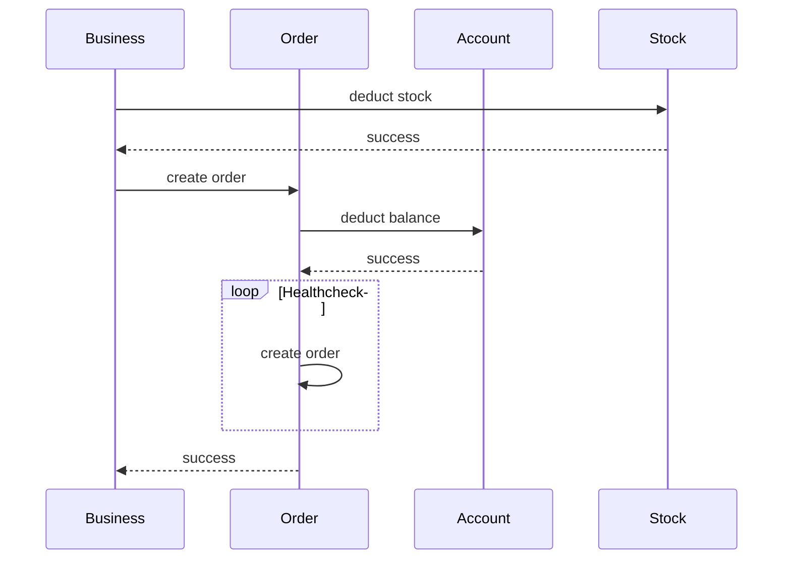
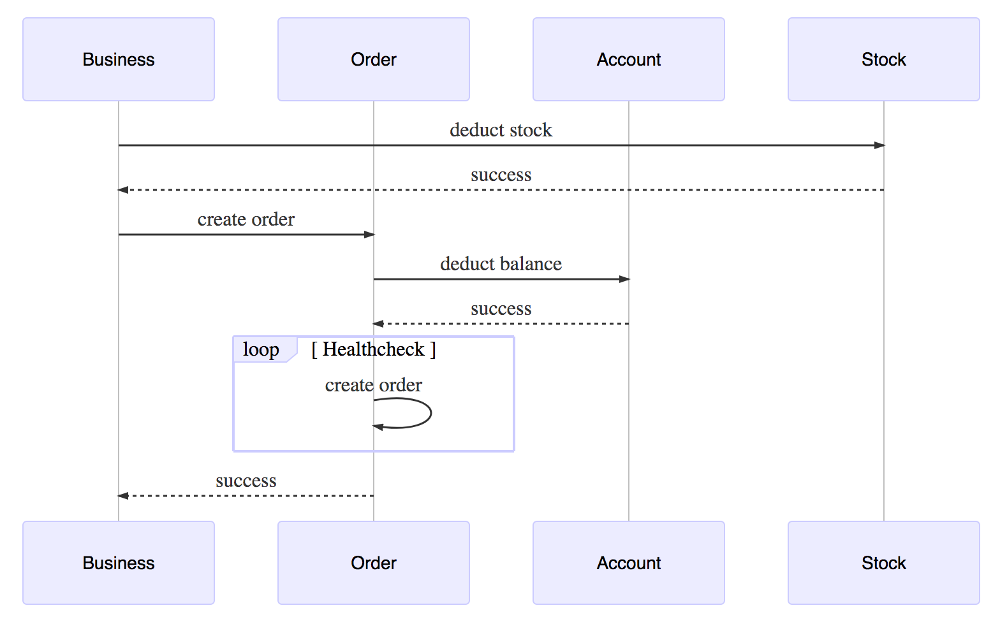

# Samples

```mermaid
sequenceDiagram
    participant Business
    participant Order
    participant Account
    participant Stock
    Business->>Stock: deduct stock
    Stock-->>Business: success
    Business->>Order: create order
    Order->>Account: deduct balance
    Account-->>Order: success
    loop Healthcheck
        Order->>Order: create order
    end
    Order-->>Business: success
```

由于gitlab不支持mermaid，示例调用时序图如下：

